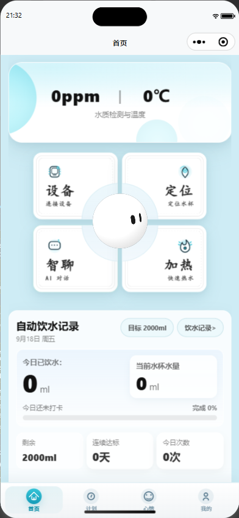
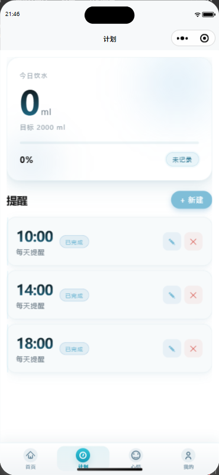
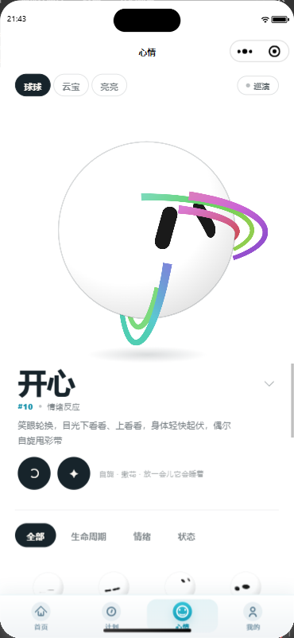
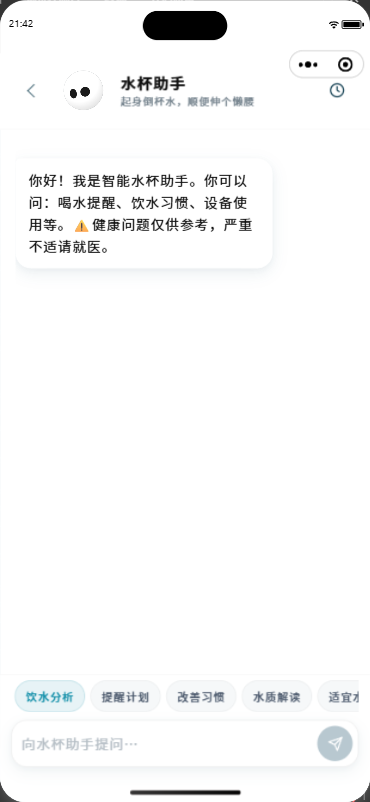
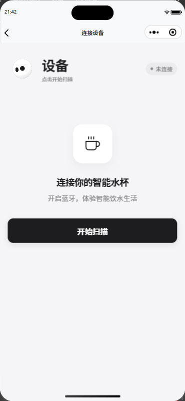
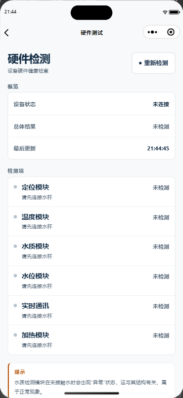

<div align="center">


# SmartCup 智能水杯小程序

围绕「喝水」这一件事，提供饮水记录与提醒、饮水计划、水温 / 水量 / TDS 水质展示、心情宠物、AI 聊天助手、地图定位与家人关爱等功能。

**微信小程序原生开发 · 微信云开发（TCB） · Canvas 表情引擎**

</div>

<p align="center"></p>

## 功能一览

| 模块 | 说明 |
| --- | --- |
| 首页 | 今日饮水量、目标完成度、水温 / 水量 / 水质卡片，饮水宠物球 |
| 计划 | 自定义饮水计划、喝水提醒（订阅消息 / 前台提醒） |
| 心情 | 三形态虚拟宠物（球球 / 云宝 / 亮亮），基于 Canvas 表情引擎 |
| 数据 | 饮水历史与统计图表 |
| 设备 | 蓝牙（BLE）连接水杯，读取水量 / 水温 / TDS |
| 打卡 | 每日打卡、饮水打卡 |
| 聊天 | AI 喝水助手（通过云函数代理调用 LLM，默认 DeepSeek） |
| 地图 | 定位展示、GPS 轨迹上报与查询 |
| 家人关爱 | 远程关注长辈 / 孩子的饮水情况 |
| 更多 | 水质标准百科、饮水百科、权限管理、设置、诊断页 |

## 界面预览

> 需要特别说明的是，当前所展示的界面仅为系统中的部分代表性界面示例，并非系统包含的全部界面内容。

<div align="center">

<table>
    <tr>
        <th>首页 · 数据总览</th>
        <th>计划 · 提醒管理</th>
        <th>心情 · 表情引擎</th>
    </tr>
    <tr>
        <td><a href="images/weixin_cup/home_page_image.png"></a></td>
        <td><a href="images/weixin_cup/paln_image.png"></a></td>
        <td><a href="images/weixin_cup/expression_image.png"></a></td>
    </tr>
    <tr>
        <td><strong>聊天 · AI 助手</strong></td>
        <td><strong>设备 · 蓝牙连接</strong></td>
        <td><strong>诊断 · 硬件检测</strong></td>
    </tr>
    <tr>
        <td><a href="images/weixin_cup/chat_image.png"></a></td>
        <td><a href="images/weixin_cup/connect_image.png"></a></td>
        <td><a href="images/weixin_cup/test_image.png"></a></td>
    </tr>
</table>

<sub>点击任意截图可在新页面查看原图</sub>

</div>

### 模块说明

- **首页**：水质检测与温度卡片实时展示 TDS 与水温；设备 / 定位 / 智聊 / 加热四宫格快捷入口环绕中央表情宠物球；下方「自动饮水记录」卡片汇总今日饮水量、当前杯中水量、目标完成度、剩余量、连续达标天数与今日打卡次数，核心数据一屏尽览。
- **计划**：顶部概览今日饮水量与目标（2000 ml）完成进度；「提醒」列表支持新建、编辑、删除喝水提醒（如 10:00 / 14:00 / 18:00 每天提醒），已执行的提醒自动打上「已完成」标签，配合订阅消息准时催你喝水。
- **心情**：基于 Canvas 表情引擎的三形态虚拟宠物（球球 / 云宝 / 亮亮）自由切换；大画布实时演绎「开心」等情绪反应动画，下方可按生命周期 / 情绪 / 状态筛选全部表情并随时回放。
- **聊天**：AI 喝水助手「水杯助手」，内置饮水分析、提醒计划、改善习惯、水质解读等快捷提问入口，回复附带健康提示（仅供参考，严重不适请就医）；底层通过云函数代理调用 LLM（默认 DeepSeek）。
- **设备连接**：通过蓝牙（BLE）扫描连接智能水杯，连接成功后即可在首页同步水量 / 水温 / TDS 实时数据。
- **硬件测试**：设备硬件体检室，支持逐项检测定位、温度、水质、水位、实时通讯、加热六大模块，汇总总体结果并给出异常提示，方便快速排查水杯连接问题。

## 技术栈

- 微信小程序原生开发（WXML / WXSS / JS，webview 渲染，自定义 tabBar）
- 微信云开发：云函数 + 云数据库
- 云函数：`wx-server-sdk`、`node-fetch`
- Canvas 2D：心情宠物表情引擎（`utils/mates`、`utils/emotion`）

## 目录结构

```
├── app.js                  # 应用入口：云环境初始化、提醒服务、全局错误上报
├── app.json                # 页面注册、tabBar、权限声明
├── pages/                  # 页面（launch / index / plan / mood / data / device / chat ...）
├── components/
│   └── pet-ball/           # 首页宠物水球组件
├── custom-tab-bar/         # 自定义底部导航
├── cloudfunctions/         # 云函数
│   ├── bindCup/            # 用户-水杯绑定
│   ├── drinkRecord/        # 饮水记录读写
│   ├── familyCare/         # 家人关爱（跨账号数据共享）
│   ├── gpsLatest/          # 最新位置查询
│   ├── hydrationAdvice/    # 饮水建议
│   ├── llmProxy/           # LLM 聊天代理（默认 DeepSeek）
│   └── mapProxy/           # 地图服务代理
├── utils/
│   ├── ble.js              # 蓝牙连接
│   ├── checkinCore.js      # 打卡核心逻辑
│   ├── drinkData.js        # 饮水数据存取
│   ├── waterReminderCore.js / planReminderCore.js  # 提醒核心逻辑
│   ├── deviceRegistry.js   # 设备注册表
│   ├── llm.js / llmConfig.js   # LLM 客户端封装
│   ├── mates/ emotion/     # 宠物表情引擎（角色、几何、渲染、动画）
│   └── wxCompat.js         # 多端兼容层（手机 / 桌面端）
└── project.config.json     # 项目配置
```

## 快速开始

### 1. 环境准备

- [微信开发者工具](https://developers.weixin.qq.com/miniprogram/dev/devtools/download.html)（稳定版）
- 已开通[微信云开发](https://developers.weixin.qq.com/miniprogram/dev/wxcloud/basis/getting-started.html)的小程序 AppID
- Node.js（云函数本地调试需要）

### 2. 配置项目

1. 将本项目导入微信开发者工具。
2. 在 `project.config.json` 中把 `appid` 替换为你自己的小程序 AppID。
3. 在 `app.js` 中配置云开发环境 ID：

   ```js
   globalData: {
     envId: "cloud1-xxxxx"  // 留空则使用开发者工具当前选择的云环境
   }
   ```

4. 如需使用 npm 依赖，在项目根目录执行：

   ```bash
   npm install
   ```

   然后在微信开发者工具中执行「工具 → 构建 npm」。

### 3. 部署云函数

在微信开发者工具中，右键 `cloudfunctions/` 下的每个云函数，选择「上传并部署：云端安装依赖」。

### 4. 配置 LLM 聊天（可选）

`llmProxy` 云函数默认调用 DeepSeek API，需在其云端环境变量中配置：

| 环境变量 | 说明 | 默认值 |
| --- | --- | --- |
| `LLM_API_KEY`（或 `DEEPSEEK_API_KEY`） | LLM API Key，**必填** | 无 |
| `LLM_BASE_URL` | OpenAI 兼容接口地址 | `https://api.deepseek.com/v1` |
| `LLM_MODEL` | 模型名 | `deepseek-chat` |
| `LLM_MAX_TOKENS` | 单次回复 token 上限 | `300` |
| `LLM_MAX_HISTORY_MESSAGES` | 携带的历史消息条数 | `6` |
| `LLM_HTTP_TIMEOUT_MS` | 上游请求超时（ms） | `55000` |

### 5. 运行

在微信开发者工具中编译运行即可，入口页为 `pages/launch/launch`（模拟加载后自动进入首页）。

## 多端兼容

- 兼容手机端与桌面端（PC / Mac 微信），桌面端自动进入兼容模式（关闭常亮、提醒等服务）。
- 适配安全区（`env(safe-area-inset-bottom)`）。
- 尊重系统「减少动态效果」（prefers-reduced-motion）设置。

---

## 许可与使用限制

**本项目仅供个人学习、研究与交流使用，严禁用于任何商业用途。**

未经作者书面许可，任何人不得将本项目的全部或部分代码、资源用于商业产品、商业服务、SaaS、客户交付或其他营利性场景。如需商业使用，请先与作者联系获取授权。

### 第三方内容声明

- `utils/emotion/`（球球表情引擎）与 `utils/mates/`（云宝 / 亮亮角色）移植并修改自开源项目 [aora-bot](https://github.com/sam70361/aora-bot)（© sam70361），遵循原项目许可条款：**仅供个人学习研究，禁止商业用途**，其角色视觉形象不提供任何商业授权。上述目录内容的版权归原项目作者所有，本声明不对其重新授权。

## 免责声明

本项目为智能水杯的配套软件，硬件部分不在本仓库范围内。本项目按「现状」提供，仅供学习交流使用，作者不对因使用本项目而产生的任何直接或间接损失承担责任。
